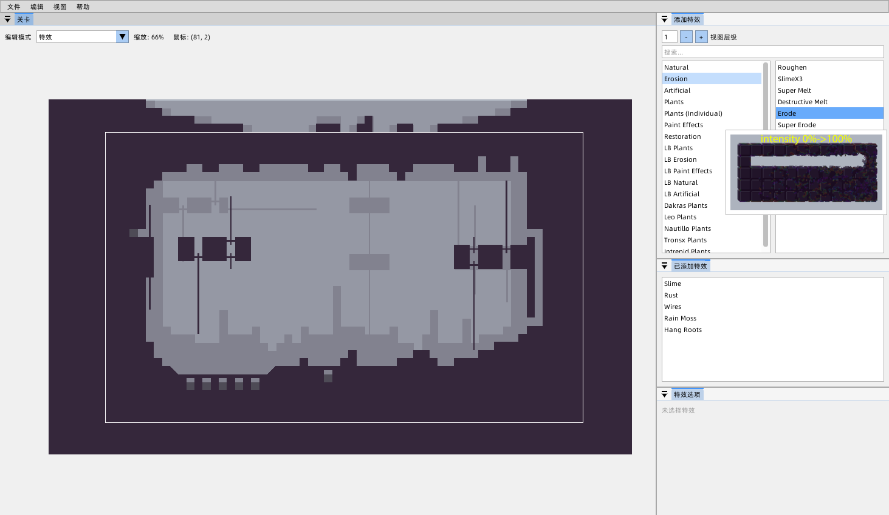
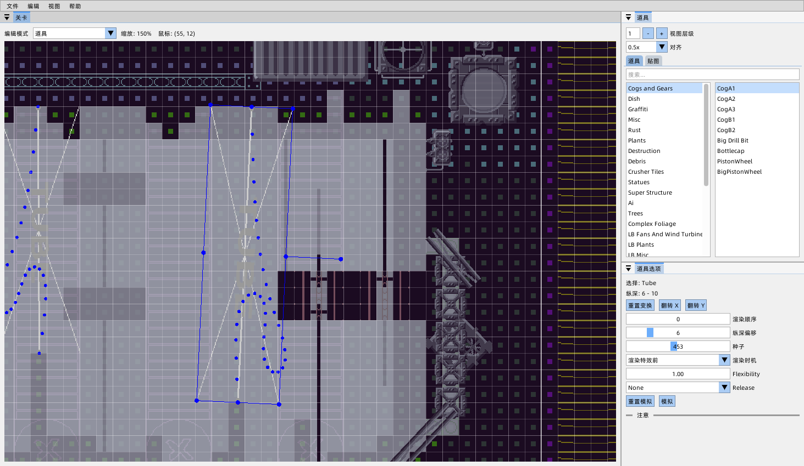

Note: This fork is a Chinese translation. If you need the English version, please go to the upstream repository.
# 有关此fork:Rained (Chinese translation | 中文翻译版)
此fork在rained的基础上进行二次开发，实现了一些更加方便的功能和部分中文翻译。

- 添加了部分特效effect的预览效果(预览图来源于[rwe+](https://github.com/timofey260/RWE-Plus))
- 添加了部分中文翻译




## 在第一次进入时如中文显示乱码或? 请在 编辑>偏好 中将字体设为 AlibabaPuHuiTi.ttf

以下为README文件
# Rained
<p align="center">
    
    <br />
    <a href="https://github.com/pkhead/rained/releases">Downloads</a> | <a href="https://pkhead.github.io/rained/en/">Manual</a>
</p>


Another Rain World level editor. Read [this document](dist/README.md), which is bundled with every release package, for more information on how to use this software.

Please note that the "main" branch is ahead of the latest release, but is in sync with Nightly. If you want to access the repository
at the time of a certain release, use the Git tags system.

## Features
- Ease of use
- Undo/redo everything
- Re-envisioned prop editor
- Highly customizable UI
- Asset graphics and palette previews
- [Drizzle](https://github.com/SlimeCubed/Drizzle/tree/community) level rendering with a preview
- Exiting from the light editor does not mess up the screen
- Pressing escape does not crash the program

## Screenshots


## Building
> [!tip]
> Additional documentation about the development setup is found [here](https://pkhead.github.io/rained/en/developing.html).

Prerequisities:
 - .NET Core toolchain
 - Python 3
 - *(optional)* OpenGL ES driver or [ANGLE libraries](src/Glib/angle) in the DLL search path.
 - *(optional)* [glslang](https://github.com/KhronosGroup/glslang) CLI

Clone with Git:
```bash
git clone --recursive https://github.com/pkhead/rained
cd rained
```

### Building Drizzle
These steps only need to be followed on the initial build or if you have updated Drizzle.

Compile Drizzle:
```bash
cd src/Drizzle
dotnet run --project Drizzle.Transpiler
```

Back to root directory, export some Drizzle data for Rained to build with:
```bash
dotnet run --project src/DrizzleExport.Console effects src/Rained/Assets/effects.json
```

### Generating Lua API
This step only needs to be run once, or whenever you update ImGui.NET.

In the root directory, run:
```bash
python3 lua-imgui-gen.py
```

This will generate the Lua API for the imgui module.

### Building Rained

#### .NET CLI and Cake
From the root directory, build and run Rained
```bash
# only needs to be run once
dotnet tool restore

# usage of desktop GL or GLES/ANGLE is determined by OS.
dotnet cake

# alternative build command with desktop GL forced on.
dotnet cake --gles=false

# run the project!
dotnet run --no-build --project src/Rained/Rained.csproj
```

#### .NET CLI alone
This is a translation of the Cake build script:
```bash
# validate/compile updated shader source files
# if you don't have glslangValidator, just skip these steps.
python3 shader-preprocessor.py gl330
python3 shader-preprocessor.py gles300

# you have three options here:
dotnet build src/Rained/Rained.csproj /p:GL=ES      # you can build with ES/ANGLE
dotnet build src/Rained/Rained.csproj /p:GL=Desktop # or you can build with normal OpenGL
dotnet build src/Rained/Rained.csproj               # this will auto-select based on OS. windows = GLES/ANGLE, linux = OpenGL
```

Upon first startup, you can configure where your Data folder is located. If you chose to download and install it, Rained will download and extract [this repository](https://github.com/SlimeCubed/Drizzle.Data/tree/community).

## Contributing
Report bugs and other complaints by creating an issue or pinging @chromosoze on a Rain World modding Discord server. DM requests also work, but it's likely that it'll take me a while to notice them as I don't pinged for it.

Pull requests are welcome.

Documentation about the development setup is found [here](https://pkhead.github.io/rained/en/developing.html).