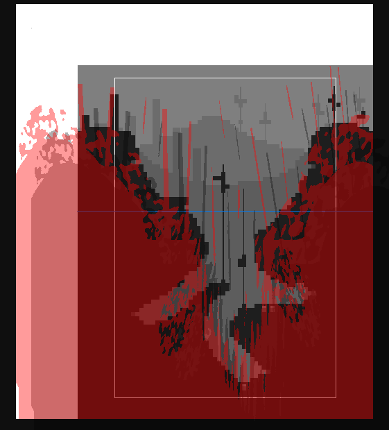

# Light
This is the editor used to control light and shadows in the level.

## Light angle
<figure markdown="span">
    
</figure>

The top-right corner of screen houses the window used to control the direction of the light as well as its distance. You can control the two parameters either using the sliders, interacting with the light ring using the mouse, or using WASD while holding <kbd>Shift</kbd>.

What the light angle does is self-explanatory, but it should be noted that it's suggested to keep it near the top-left as tile/prop lighting normally assume that is the direction light is coming from.

The light distance parameter, or otherwise known as "flatness", controls the length of shadows. As the parameter decreases, rendered shadows will become shorter. Inversely, as the parameter increases, rendered shadows will become longer. It is similar to the way shadows in real life behave based on the position of the sun. A overhead sun is what represents the light distance being zero, with shadows being very short. As the sun (or the point on the light ring) moves away from the center, shadows become longer.

## Light map
<figure markdown="span">
    
</figure>

The level viewport is dedicated to the editing of the light map. It is a black-and-white image, with white areas (transparent in the editor) representing sunlight and black areas (red and translucent in the editor) representing shadows. The image's shadow is casted onto the world, as if viewing the shadows casted by objects and structures behind the camera. The shadow projection shown in the light editor is not entirely accurate to what it will look like in-game, since it does not account for the different sublayer depths. But it is still a good approximation.

!!! info

    Light maps have extra space that extend past the top and left sides of the level, which is represented by the area with the white background in the editor.

Light maps are usually fairly simple. As a rule of thumb, if you have an interior room, the light map should be mostly filled with shadow except for some gaps or windows, small or large, where light peeks through. If you have an outside room, the light map will be mostly filled with light except for the shadows of some structures/motifs resembling those found in the level or region itself. As always, it is best to analyze the light maps of pre-existing rooms yourself.

!!! note

    If you notice the level is being rendered in complete darkness even though you have light in your light map, it's likely that you've disabled sunlight in the environment editor.

You edit this light map as if you were drawing an image in a paint editing program. You first select the brush shape that you want from the bottom-right window titled "Brush", either by clicking on them or using WASD. Then, when you want to paint shadows, you hold down the left mouse button over the level viewport, and when you want to erase shadows, you hold down the right mouse button instead.

The brush can also be scaled and rotated. To scale the brush, you hold down the <kbd>Q</kbd> key and move your mouse. To rotate the brush, you hold down the <kbd>E</kbd> key and move your mouse up or down. If you don't like this methodology, you can change the *Light editor control scheme* setting to "Keyboard". With that, you scale using the WASD keys, rotate clockwise by holding <kbd>E</kbd>, and rotate counter-clockwise by holding <kbd>Q</kbd>. Holding down <kbd>Shift</kbd> will make it faster.

!!! note

    Changing the setting to "Keyboard" also removes the ability to browse through the brush catalog using WASD.