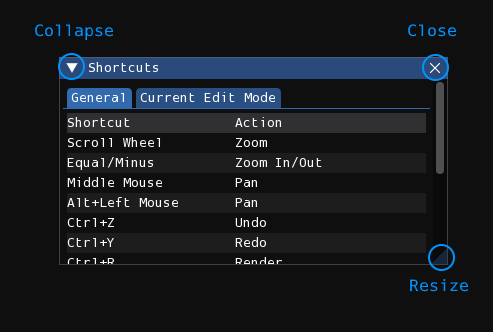

# User interface
The user interface is comprised of windows, with each window containing many widgets such as buttons, sliders, text, e.t.c.

## Windows
### Floating windows

<figure markdown="span">
    
</figure>

- **Collapse**: The window's contents will be hidden, leaving only the titlebar visible. Click again to expand the window, restoring it to normal.
- **Close**: This button may not be on all windows. For those that are, once closed, the window can be re-opened from one of the menus.
- **Resize**: Drag this and move your mouse to resize the window. You may also drag them by the edges to resize them along that edge.

A window can be moved by clicking and dragging from either the title bar or an unoccupied space from within the window. If dragged by the titlebar, the window can be docked. Overlays will appear on the user interface, and dragging your mouse over one of them will allow you to choose where a window will be docked.

<figure markdown="span">
    
</figure>

In addition, windows can be dragged by its titlebar without showing the docking overlays by holding <kbd>Shift</kbd>. After being docked, the window can be undocked by dragging it by its titlebar.

### Docked windows

<figure markdown="span">
    
</figure>

Docked windows will have a button that resembles an upside-down "eject" icon. This is used as either a vertical tab list, for docked windows that are tabbed into the same space, or a button to open a popup that allows you to hide or show the tab bar.

When the tab bar is hidden, a little right triangle will be visible on the top left of the window. Clicking the triangle will once again show the tab bar.

## Widgets
Most widgets are obvious, but some have special interactions that should be noted.

### Slider

Click and drag your mouse horizontally on this widget to change its value.
If <kbd>Ctrl</kbd>/<kbd>Cmd</kbd> is held while clicking, you can type in the value of the slider.

### Drag input

These work identically to sliders, except that there is no visual knob and also no limit on the minimum or maximum value.
Like sliders, if <kbd>Ctrl</kbd>/<kbd>Cmd</kbd> is held while clicking, you can type in the value of the input.

## Menubar
Rained adopts the standard concept of a "menubar", a collection of menus/submenus in a bar that is located at the very top of the window.

Whenever this documentation refers to an item in the menubar, it will do so by first naming the menu the item is in, followed by a `>`, and then finally the name of the item with or without ellipses at the end if present, all within preformatted text. For example, `File > Open` or `Help > About`.

**File**
:   - **New**: Create a new level.
    - **Open**: Open a level from disk.
    - **Open Recent**: Open a level that was recently opened.
    - **Save**: Save the level to disk.
    - **Save As**: Choose a file on disk and save the level to it.
    - **Render**: Render the level using Drizzle.
    - **Export Geometry**: Export the geometry of the level without rendering the visuals, using Drizzle.
    - **Preferences**: Open the preferences window.
    - **Quit**: Quit Rained.

**Edit**
:   - **Undo**: Undo an action.
    - **Redo**: Redo an action.
    - **Resize Level**: Open the level resize window.
    - **Commands**: List of plugin/script commands that can be executed.
    - Edit actions for the current edit mode will be shown in this menu.

**View**
:   - **Zoom In**: Zoom the viewport inwards.
    - **Zoom Out**: Zoom the viewport outwards.
    - **Reset View**: Reset the viewport zoom and pan.
    - **Grid**: Toggle the visibility of the grid.
    - **Tiles**: Toggle the visibility of tiles outside of the Tiles edit mode.
    - **Props**: Toggle the visibility of props outside of the Props edit mode.
    - **Camera Borders**: Toggle the visibility of camera boundaries.
    - **Tile Graphics**: Toggle whether or not tiles are rendered using the in-game render or the editor preview.
    - **Obscured Beams**: If on, will show negative space for a horizontal or vertical beam if placed inside a wall.
    - **Tile Heads**: If on, will show a cross at the location of each tile head in the level.
    - **Keyboard Shortcuts**: Toggle the visibility of the keyboard shortcuts window.
    - **Logs**: Toggle the visibility of the logs window.
    - **Palettes**: Toggle the visibility of the palettes window.
    - **Show Data Folder**: Open the system's file browser to the Drizzle data folder.
    - **Show Render Folder**: Open the system's file browser to the folder where Drizzle outputs level renders.

**Help**
:   - **Manual**: Opens your preferred file browser to this website.
    - **About**: Shows/hides the about window.