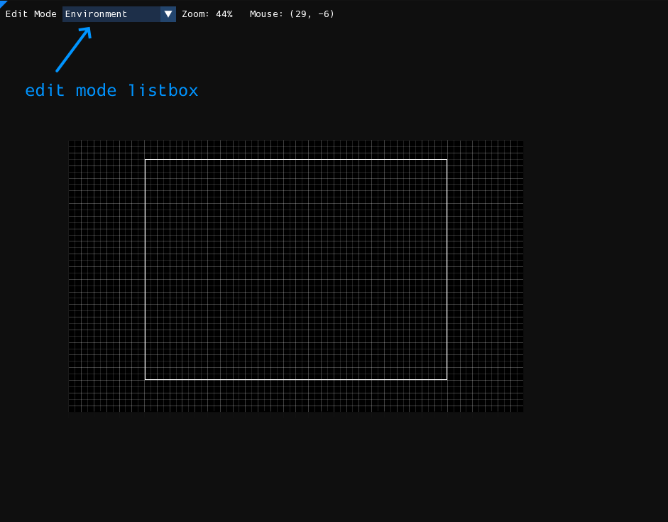
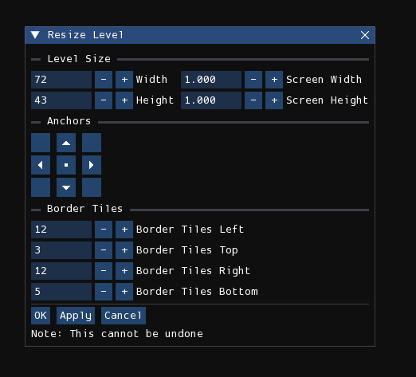

# Overview
Each level is composed of three work layers that each form a grid. The first layer is the one that is closest to the camera and that all creatures will collide and interact with. The second layer is the layer that is second closest to the camera and the first background layer. Certain creatures may be able to interact with this layer by, for example, climbing on it. The third, final layer, is the furthest layer and cannot be interacted with by any creatures.

Levels are created in the level editor are then are rendered into:

- one text (.txt) file, containing only the information needed by the game to store things like the water level and level collision;
- and several image (.png) files, each for each camera, containing the visual of the level for an entire screen.

The files rendered for the game are incompatible with the files for the level editor, and vice versa.

## Level viewport

The level viewport is the window that takes up the majority of the screen. It is where you can see and interact with the level that is currently being edited.

You can zoom in and out by using the scroll wheel, the buttons in the View menu, or the <kbd>+</kbd>/<kbd>-</kbd> keys. Panning the level is done by either moving the mouse while holding down the middle mouse button or <kbd>Alt</kbd> key, or by using the arrow keys. If you are using the arrow keys, holding <kbd>Shift</kbd> will speed up the panning.

## Border
Rain World levels have a border which dictates the region of the level that is interactable in-game. The border is displayed in Rained as a white rectangle.

Anything outside of the border rectangle will appear in the .png renders of the level, but will not be present in the .txt file describing the geometry of the level. As such, creatures interacting with geometry outside of the level border will either pass through solid blocks or stand on thin air, depending on the closest block that is inside the border at a given position. Any objects in the geometry editor that is outside of the border will be colored red instead of white, indicating that the object will have no effect in-game.

## Resizing
Pressing the "Resize Level" button in the **Edit** menu will open this window:

- **Width/Height**: This is the desired width and height of the level in grid units.
- **Screen Width/Screen Height**: This is the desired width and height of the level in screens. Below are the formulas used for grid unit/screen conversion.

        Width = 52 * Screens + 20
        Height = 40 * Screens + 3

- **Anchors**: Controls the origin point of the resize operation. It can be set to one of the four corners of the level, the centers of the four edges, or the center of the level.
- **Border Tiles**: Controls the offset from the level's edge for each edge of the level border.

## Edit modes
Each level has several aspects that can be edited in separate "edit modes", also called "editors" by most people.

Listed are all seven edit modes:

- **[Environment](editors/env.md)**: Edit miscellaneous properties about the level.
- **[Geometry](editors/geo.md)**: Edit the playable geometry and objects in the level.
- **[Tiles](editors/tiles.md)**: Place pre-made tile assets in the level to make it look like something.
- **[Cameras](editors/cameras.md)**: Edit cameras.
- **[Light](editors/light.md)**: Edit lights and shadows.
- **[Effects](editors/effects.md)**: Control procedurally generated decorations, erosion, plants, and other effects.
- **[Props](editors/props.md)**: Place pre-made assets in the level with full freedom of positioning, rotation, and scaling.

The current edit mode can be changed by either pressing number keys 1-7, selecting an option from the "Edit Mode" listbox located near the top-left of the screen, or by opening the radial menu using the <kbd>`</kbd> button.