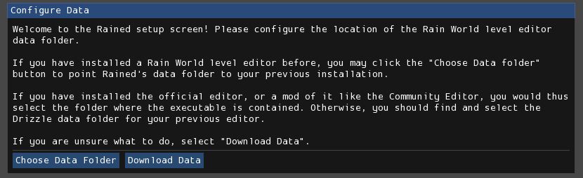

# 安装与更新
有两种方法可以安装和更新 Rained：从 GitHub 发布页面下载，或使用 rainedvm。这两种方法可以互换使用。

## 从 GitHub 安装
你可以从 [GitHub 发布页面](https://github.com/pkhead/rained/releases) 安装 Rained。下载适用于你平台的压缩包（.zip 或 .tar.gz），并将其解压到磁盘上。执行名为 "Rained.exe" 或 "Rained" 的文件以启动 Rained。如果你在 Windows 上，还会有一个名为 "Rained.Console.exe" 的可执行文件，用于从终端或命令行工具运行。在 Linux 上，不需要这种分离，因此不包含该文件。

Rained 会在启动时或在“关于”窗口中通知你是否有新更新。你可以在首选项窗口中禁用更新检查器。

如果你想更新 Rained，你应该删除并替换安装文件夹中的所有文件和文件夹，**除了**：

- config/
- 你的 Data 文件夹（如果存在）。

然后，从发布页面下载并解压新版本的 Rained。

你应该确保你在任何文件中做出的潜在更改不会被意外覆盖。此外，如果你在更新后打开 Rained 并且窗口布局混乱，你可以选择自己修复（繁琐），或者用新版本中的 config/imgui.ini 文件替换当前文件。

## rainedvm
rainedvm 是一个简化 Rained 版本维护过程的程序。下载地址在[这里](https://github.com/pkhead/rainedvm/releases)。

在下载的 .zip 或 .tar.gz 文件中包含可执行文件 **rainedvm**。只需将其解压并放入你想要安装 Rained 的文件夹中。然后，启动该可执行文件，它将打开一个如下所示的窗口：

<figure markdown="span">
    
</figure>

选择你想要安装的版本，然后按下“安装”按钮。完成后，你可以从文件管理器中运行 Rained。

Rained 会在启动时或在“关于”窗口中通知你是否有新更新。你可以在首选项窗口中禁用更新检查器。

如果你想更新 Rained，再次运行 rainedvm，选择你想要升级到的版本，然后按下“安装”。如果你在更新后启动 Rained 并且窗口布局混乱，删除 config/imgui.ini 文件，在版本管理器中选择你当前的版本，然后按下“同步”（替换“安装”按钮）。这将将该版本的窗口配置重置为默认值。

### 文件冲突
rainedvm 会检测你是否修改了任何文件（除了 config/preferences 和 config/imgui.ini），如果该文件在新版本中发生了变化，它会询问你是否要用新版本覆盖更改，或保留你的文件更改。在每个提示中，如果你希望更新文件，请选择“覆盖更改”。否则，选择“保留更改”。你也可以通过按下“取消”按钮来取消整个操作。

## 资源安装
你第一次启动 Rained 时，界面应该如下所示：

<figure markdown="span">
    
</figure>

!!! 注意

    如果你的电脑上没有安装其他 Rain World 关卡编辑器，请选择“下载数据”。否则，请继续阅读。

每个 Rain World 关卡编辑器都应附带一组图块、道具以及原版和 Downpour 关卡。然而，尝试在不同的关卡编辑器中使用相同的图块、道具和创建的关卡可能会很麻烦，因为它们有自己的文件夹/目录来存储这些数据。此外，捆绑的关卡文件集大约占用 4 GB 的存储空间。

为了解决这个问题，Rained 允许你选择是否要使用电脑上已有的目录来存储图块、道具和关卡。如果你的电脑上尚未安装这些文件（或者你只是想下载），你需要选择“下载数据”。它将从互联网下载所需的文件。否则，你可以选择“选择数据文件夹”。这将打开一个文件浏览器，你可以选择正确的数据目录。你选择的目录应包含以下子目录：

- Graphics
- Props
- Levels
- LevelEditorProjects *(可选)*
- Materials *(可选)*

你也可以在初始设置后更改数据目录。这可以通过修改首选项窗口中“资源”页面中的“数据路径”选项来完成（**文件 > 首选项**）。

!!! 注意

    当你选择“下载数据”时，进度条在大部分时间内会保持在 0%。这是所使用的下载提供商的故障。

## 依赖项
!!! 注意

    本节仅与在 Windows 上运行 Rained 相关。

Rained 唯一的依赖项是 Microsoft Visual Studio C++ 运行时。Rained *是* 用 C# 编写的，但它用于窗口和图形的一些库是用 C++ 编写的，因此需要该运行时。

要检查你是否安装了所需的依赖项，只需尝试运行 Rained。如果它无法打开窗口并启动失败，很可能你需要安装它。幸运的是，这非常简单。C++ 运行时的安装程序可以从[这里](https://aka.ms/vs/17/release/vc_redist.x64.exe)下载。运行该可执行文件，安装过程完成后，你现在可以运行 Rained。