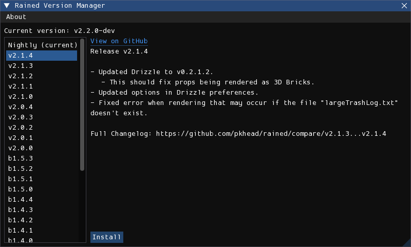

# 安装和更新
Rained有两种安装和更新的方法：从GitHub发布页面下载，或使用rainedvm。这两种方法可以互换使用。

## 从GitHub安装
你可以从[GitHub发布页面](https://github.com/pkhead/rained/releases)下载Rained。根据你的平台下载相应的压缩包（.zip或.tar.gz），然后将其解压到磁盘上。执行名为“Rained.exe”或“Rained”的文件以启动Rained。如果你在Windows系统上，还会有一个名为“Rained.Console.exe”的可执行文件，它是为了在终端或从命令行工具中运行而存在的。在Linux系统上，不需要这样的区分，因此不包含该文件。

Rained在启动或在“关于”窗口中应该会通知你任何新更新。你可以在偏好设置窗口中禁用更新检查器。

如果你想更新Rained，应该删除并替换安装文件夹中的所有文件和文件夹，但**除了**：

- config/
- 如果存在的话，你的数据文件夹。

然后，从发布页面下载并解压Rained的新版本。

你应该确保对任何文件所做的任何潜在更改都不会被意外覆盖。此外，如果在更新后打开Rained并且窗口显示不正常，你应该自己修复它（可能很繁琐），或者用新版本中的“config/imgui.ini”文件替换它。

## rainedvm
rainedvm是一个程序，可以简化Rained版本的维护过程。下载地址[在这里](https://github.com/pkhead/rainedvm/releases)。

在.zip或.tar.gz下载文件中是名为**rainedvm**的可执行文件。只需将其解压并放入你想安装Rained的文件夹中。然后，启动可执行文件，应该会打开一个如下所示的窗口：

<figure markdown="span">
    
</figure>

选择你要安装的版本，然后点击“安装”按钮。安装完成后，你可以从文件管理器中运行Rained。

Rained在启动或在“关于”窗口中应该会通知你任何新更新。你可以在偏好设置窗口中禁用更新检查器。

如果你想更新Rained，再次运行rainedvm，选择你要升级到的版本，然后点击“安装”。如果在更新后启动Rained并且窗口显示不正常，删除“config/imgui.ini”文件，在版本管理器中选择你当前的版本，然后点击“同步”（会替换“安装”按钮）。这将将该版本的窗口配置重置为默认设置。

### 文件冲突
rainedvm会检测你是否修改了任何文件（除了config/preferences和config/imgui.ini），并且如果该文件在新版本中被更改了，它会询问你是要用新版本覆盖更改，还是要保留你的文件更改。在每个提示中，如果你想更新文件，选择“覆盖更改”。否则，选择“保留更改”。你也可以在此时通过点击“取消”按钮取消整个操作。

## 资产安装
你首次启动Rained时应该会看到这样的界面：

<figure markdown="span">
    
</figure>

!!! 注意

    如果你的计算机上没有安装其他Rain World关卡编辑器，请选择“下载数据”。否则，请继续阅读。

每个Rain World关卡编辑器都应该附带一组图块、道具以及原版和Downpour版本的关卡。然而，尝试在不同的关卡编辑器中使用相同的图块、道具和创建的关卡可能会很繁琐，因为它们有自己的文件夹/目录来存储这些数据。此外，捆绑的关卡文件集大约需要4GB的存储空间。

为了适应这一点，Rained允许你选择是否希望它使用计算机上预先存在的目录来存储图块、道具和关卡。如果你还没有在计算机上安装这些（或者你只是想要），你需要选择“下载数据”。它将从互联网上下载所需的文件。否则，你可以选择“选择数据文件夹”。这将打开一个文件浏览器，你可以在其中选择正确的数据目录。你选择的目录应该包含以下子目录：

- Graphics
- Props
- Levels
- LevelEditorProjects *（可选）*
- Materials *（可选）*

你也可以在此初始设置之后更改数据目录。这可以通过修改位于偏好设置窗口的“资产”页面中的“数据路径”选项来完成（**文件 > 偏好设置**）。

!!! 注意

    当你选择“下载数据”时，进度条在大部分时间都会保持在0%。这是所使用的下载提供商的一个缺陷。

## 依赖项
!!! 注意

    本节仅适用于在Windows系统上运行Rained的情况。

Rained的唯一依赖项是Microsoft Visual Studio C++运行时。Rained是用C#编写的，但它使用的一些用于窗口和图形的库是用C++编写的，这就是为什么需要它。

要检查是否已安装所需的依赖项，只需尝试运行Rained。如果它无法打开窗口并且无法启动，那么你可能需要安装它。幸运的是，这非常简单。C++运行时的安装程序可以[在这里](https://aka.ms/vs/17/release/vc_redist.x64.exe)下载。运行可执行文件，一旦安装过程完成，你现在就可以运行Rained了。