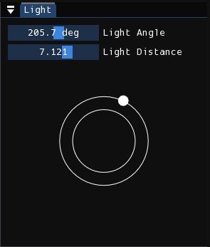
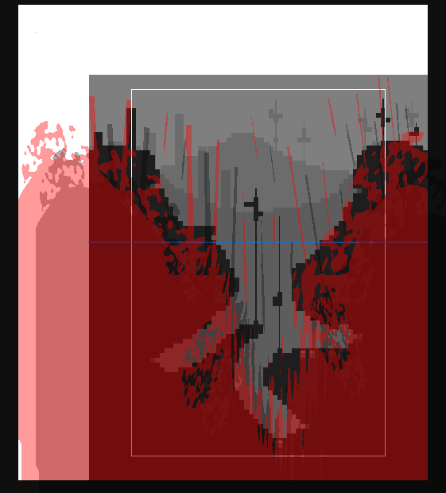

# 灯光

在关卡中用于控制灯光和阴影的编辑器。

## 灯光角度

<figure markdown="span">
    
</figure>

屏幕的右上角是用于控制光线方向及其距离的窗口。您可以使用滑块、使用鼠标与控制环交互或在按住<kbd>Shift</kbd>时使用 WASD 来控制这两个参数。

光线角度的作用是不言自明的，但应该注意的是，建议将其保持在左上角附近，因为贴图/道具照明通常假设这是光线的方向。

光线距离 参数（也称为“ flatness ”）控制阴影的长度。随着参数的减小，渲染的阴影将变得更短。相反，随着参数的增加，渲染的阴影将变得更长。它类似于现实生活中阴影根据太阳位置的行为方式。头顶上的太阳表示光距离为零，阴影非常短。当太阳（或光环上的点）远离中心时，阴影会变长。

## 光照贴图

<figure markdown="span">
    
</figure>

关卡视口专用于编辑光照贴图。它是一个黑白图像，其中白色区域（在编辑器中透明）表示阳光，黑色区域（在编辑器中为红色和半透明）表示阴影。图像的阴影投射到世界上，就像查看摄像机后面的物体和结构投射的阴影一样。灯光编辑器中显示的阴影投影并不完全准确于它在游戏中的外观，因为它没有考虑不同的图层深度。但它仍具有很好的参考价值。

!!! info

    光照贴图具有超出关卡顶部和左侧的额外空间，该空间在编辑器中以白色背景的区域表示。

光照贴图的编辑通常比较简单。根据生活经验，当你创建了一个室内房间时，光照贴图应主要以阴影填充，但别忘了，光线可以透过窗户、缝隙哦。当你创建了一个室外房间时，光照贴图应以光照为主，当然也可以添加一些类似于楼层或区域本身结构或图案的阴影。

!!! note

    如果编辑了光照贴图但渲染完成后的关卡仍是一片黑暗，可能是你在环境编辑器中关闭了日光。

编辑此光照贴图就像在图像编辑程序中绘制图像一样。首先，从右下角标题为“笔刷”的窗口中通过单击或使用 WASD 选择所需的画笔形状。然后，在光照视图中按住左键绘制阴影，按住右键擦住阴影。

笔刷也可以缩放和旋转。你可以按住<kbd>Q</kbd>键并移动鼠标进行缩放，按住<kbd>E</kbd>键时鼠标上下移动进行旋转。如果你不喜欢此方法，可以将 *灯光编辑器控制方案*设置更改为 “键盘”。这样，您可以使用 WASD 键进行缩放，按住 <kbd>E</kbd> 顺时针旋转，按住 <kbd>Q</kbd> 逆时针旋转。按住 <kbd>Shift</kbd> 会更快。

!!! note

    将设置更改为“键盘”也会禁用使用 WASD 更改笔刷的功能。
