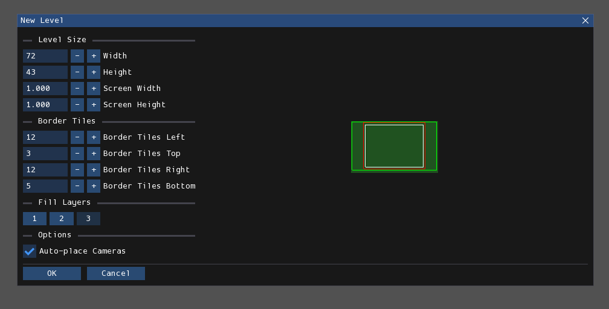

# 概述
每个关卡由三个工作层组成，每个工作层都形成一个网格。第一层是最接近摄像机的层，所有生物都会与之碰撞和交互。第二层是第二接近摄像机的层，也是第一层背景层。某些生物可能能够与这一层交互，例如，在其上攀爬。第三层，也是最后一层，是最远的层，任何生物都无法与之交互。

关卡在关卡编辑器中创建，然后渲染成：

- 一个文本（.txt）文件，仅包含游戏存储水位和关卡碰撞等信息所需的内容；
- 以及几个图像（.png）文件，每个摄像机一个，包含整个屏幕的关卡视觉效果。

为游戏渲染的文件与关卡编辑器的文件不兼容，反之亦然。

## 创建关卡
<figure markdown="span">
        
        <figcaption>“新建关卡”窗口。</figcaption>
</figure>

这是您为新创建的关卡配置选项的窗口。它有几个选项：

- **宽度/高度**：这是关卡在网格单位中的期望宽度和高度。
- **屏幕宽度/屏幕高度**：这是关卡在屏幕中的期望宽度和高度。以下是网格单位/屏幕转换使用的公式。

        宽度 = 52 * 屏幕数 + 20
        高度 = 40 * 屏幕数 + 3

- **边界**：控制关卡边界每侧边缘的距离。其目的将在[稍后](#border)解释。
- **填充层级**：控制您希望用实体几何形状填充哪些层。
- **自动放置摄像机**：如果选中，将自动放置一个或多个摄像机以适应关卡边界。如果未选中，则只会在与关卡创建参数无关的位置放置一个摄像机。

## 关卡视口
<figure markdown="span">
        
</figure>

关卡视口是占据屏幕大部分区域的窗口。您可以在其中查看和与当前正在编辑的关卡进行交互。

您可以使用滚轮、视图菜单中的按钮或<kbd>+</kbd>/<kbd>-</kbd>键进行缩放。平移关卡可以通过按住鼠标中键或<kbd>Alt</kbd>键的同时移动鼠标，或使用箭头键来完成。如果使用箭头键，按住<kbd>Shift</kbd>将加快平移速度。

## 边界
Rain World的关卡有一个边界，它决定了关卡中可在游戏中交互的区域。边界在Rained中以白色矩形显示。

边界矩形之外的任何内容都会出现在关卡的.png渲染中，但不会出现在描述关卡几何形状的.txt文件中。因此，边界之外的区域是不可交互的。尝试与关卡边界之外的几何形状交互的生物要么会穿过固体方块，要么会悬浮在空中，这取决于它们位置处边界内最近的方块。在几何编辑器中放置在边界之外的任何对象都将显示为红色而不是白色，表明该对象在游戏中将无效。

## 调整大小
在**编辑**菜单中单击“调整关卡大小”按钮将打开此窗口：

<figure markdown="span">
        
</figure>

- **宽度/高度**：这是关卡在网格单位中的期望宽度和高度。
- **屏幕宽度/屏幕高度**：这是关卡在屏幕中的期望宽度和高度。以下是网格单位/屏幕转换使用的公式。

        宽度 = 52 * 屏幕数 + 20
        高度 = 40 * 屏幕数 + 3

- **锚点**：控制调整大小操作的原点。可以将其设置为关卡的四个角之一、四个边的中心或关卡的中心。
- **边框瓦块**：控制关卡边界每侧边缘的距离。

## 编辑模式
每个关卡都有几个方面可以在单独的“编辑模式”中进行编辑，大多数人也称为“编辑器”。

以下是所有七个编辑模式：

- **[环境](env.md)**：编辑关卡的杂项属性。
- **[几何](geo.md)**：编辑关卡中的可玩几何形状和对象。
- **[贴图](tiles.md)**：在关卡中放置预先制作的图块资源，使其看起来像某种东西。
- **[相机](cameras.md)**：编辑摄像机。
- **[灯光](light.md)**：编辑灯光和阴影。
- **[效果](effects.md)**：控制程序生成的装饰、侵蚀、植物和其他效果。
- **[道具](props.md)**：在关卡中自由放置预先制作的资源，包括定位、旋转和缩放。

可以通过按数字键1-7、从屏幕左上角附近的“编辑模式”列表框中选择一个选项，或通过使用<kbd>`</kbd>按钮打开径向菜单来更改当前编辑模式。