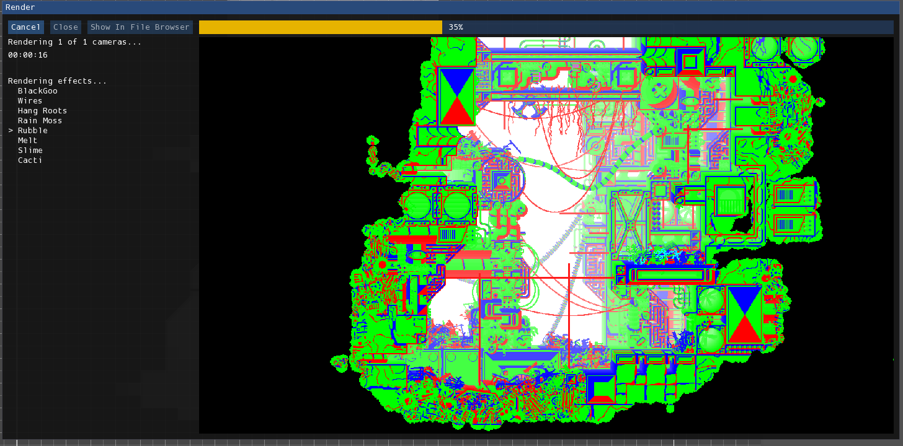
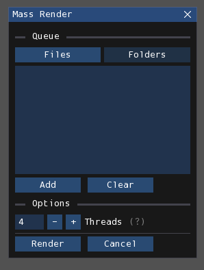

# Rendering and playing
Rendering is the process by which the level file gets processed into:

- one text (.txt) file, containing only the information needed by the game to store things like the water level and level collision;
- and several image (.png) files, one for each camera, containing the visual of the level for an entire screen.

This output can be parsed by the Rain World game so that your level can be played.

## Rendering
The render process uses [Drizzle](https://github.com/SlimeCubed/Drizzle/tree/community), a port of the original renderer used in the official level editor, which was created in Adobe Director. The project prioritizes maintaining 1:1 parity, so the difference between levels rendered with the Lingo renderer and Drizzle is very rarely noticeable. It also runs signficantly faster, so this is a pretty good tradeoff.

### Single-level rendering
You first must have the level you want to render open and active. Click on **File > Render** in order to begin the rendering process.
It will open this window:

<figure markdown="span">
    
    <figcaption>The Render window.</figcaption>
</figure>

The text on the left indicates the current status of the render. The viewport on the right is a live preview of the render.
There are also three buttons on the top-left side of the window:

- **Cancel:** Attempts to cancel the operation.
- **Close:** Close the window. Can only be done upon completion or cancellation.
- **Show In File Browser:** Show the generated files in the file browser. Can only be done upon completion.

!!! info

    If you cancel while Drizzle is initializing, it unfortunately won't be registered until the initialization process is complete. In that case, it will take a few seconds for you to be able to close the window.

### Mass rendering
You also have the option to render multiple levels at once. Click on **File > Mass Render** to begin this process. It will open this window:

<figure markdown="span">
    
    <figcaption>The Mass Render window.</figcaption>
</figure>

You first must add the levels you want to render to the queue. There are two lists, one for individual files and one for folders.
You can switch between the two by pressing the labeled buttons. Select the items you want by choosing them from the file browser that opens by pressing "Add".

You also have the option to specify the maximum amount of threads that can be used. These allow more than one level from the queue to be rendered simultaneously, decreasing the total wait. However, the more threads you have, the more RAM it takes and the more stress it puts on your CPU. Setting it too high may cause Rained or other programs to crash. Therefore, it is best to set it to a number fit for your system. As a reference, each thread will take a little less than 1 GB of RAM. The default option should be good for most computers.

## Drizzle options
There are several options available for configuring Drizzle. These can be accessed in the Drizzle page in the preferences window, opened by selecting **File > Preferences**.

### Persistent Drizzle runtime
Usually, Rained has to create and setup a new instance of Drizzle before starting a render. With this enabled, on the render afterward it will keep the created Drizzle instance and reuse it for subsequent renders. However, this means that Rained will eat up more RAM even though it's not using Drizzle.

Above this option is the button "Discard Drizzle Runtime". When clicked, it will force Rained to re-create a new Drizzle instance on the next render.

This option isn't as important, since nowadays Drizzle doesn't take so long to start up thanks to a nice optimization by Alduris.

### Configuration
There are several options available for configuring how Drizzle renders levels. This is an interface for editing the editorConfig.txt file. These options are listed below the "Rendering" category on the preferences page.

## Playing your level
Once you have a rendered level, you need copy the rendered files into a place where the Rain World game can properly see and read them.

You will need to copy the rendered .txt and .png file(s) to one of two directories:

- **Arena:** `/levels`
- **World:** `/world/XX-rooms`, where `XX` is the acronym of a region

The above directories are relative to either `RainWorld_Data/StreamingAssets`, or your mod's folder.

Putting them in the `levels` folder is the simplest way to access the levels, since you can directly access them from Arena. It is more difficult to access levels from a world folder, because you need to edit room connections in a separate .txt file in order to be able to access it.

Once you are in your level, you will use the Dev Tools to configure the level further. You will also have to edit the world_XX.txt file, either in a text editor or an external program like World Editor, to connect rooms together and add creature spawns. This manual will not go over the details of doing that, since Rained only concerns itself with level editing. Resources for that can be found [here](resources.md).