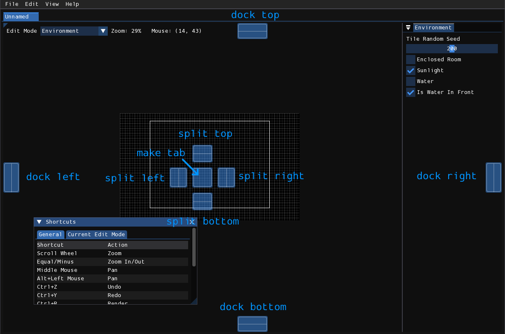
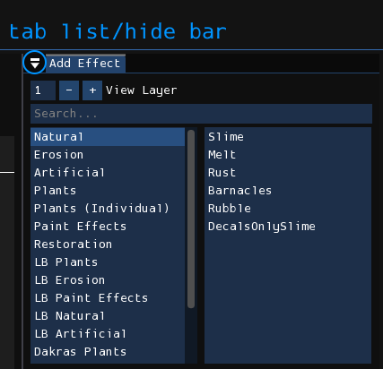
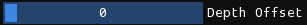
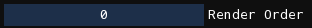

# 用户界面
用户界面由窗口组成，每个窗口包含许多小部件，如按钮、滑块、文本等。

## 窗口
### 浮动窗口

<figure markdown="span">
    
</figure>

- **折叠**：窗口内容将被隐藏，仅显示标题栏。再次点击可展开窗口，恢复原状。
- **关闭**：并非所有窗口都有此按钮。对于有此按钮的窗口，一旦关闭，可以从菜单中重新打开。
- **调整大小**：拖动此控件并移动鼠标以调整窗口大小。也可以拖动窗口边缘以沿该边缘调整大小。

可以通过点击并拖动标题栏或窗口内的空白区域来移动窗口。如果通过标题栏拖动，窗口可以停靠。用户界面上将出现覆盖层，将鼠标拖动到其中一个覆盖层上，可以选择窗口停靠的位置。

<figure markdown="span">
    
</figure>

此外，按住<kbd>Shift</kbd>键拖动窗口标题栏，可以在不显示停靠覆盖层的情况下拖动窗口。停靠后，可以通过拖动标题栏将窗口取消停靠。

### 停靠窗口

<figure markdown="span">
    
</figure>

停靠窗口将有一个类似倒立的“弹出”图标的按钮。此按钮用作停靠在同一空间中的窗口的垂直选项卡列表，或打开弹出窗口，允许隐藏或显示选项卡栏。

当选项卡栏隐藏时，窗口左上角将显示一个小右三角形。点击三角形将再次显示选项卡栏。

## 小部件
大多数小部件都很简单，但有一些小部件具有应注意的特殊交互。

### 滑块

在此小部件上水平点击并拖动鼠标以更改其值。
如果在点击时按住<kbd>Ctrl</kbd>/<kbd>Cmd</kbd>，可以输入滑块的值。

### 拖动输入

这些与滑块的工作原理相同，只是没有可视旋钮，并且没有最小或最大值的限制。
与滑块一样，如果在点击时按住<kbd>Ctrl</kbd>/<kbd>Cmd</kbd>，可以输入值。

## 菜单栏
Rained采用了标准的“菜单栏”概念，即位于窗口顶部的菜单栏，其中包含菜单/子菜单。

当本文档引用菜单栏中的项目时，将首先命名该项目所在的菜单，后跟一个`>`，然后是该项目的名称（如果末尾有省略号，则包括省略号），全部加粗。例如，**文件 > 打开**或**帮助 > 关于**。

**文件**:
:   - **新建**：创建一个新关卡。
    - **打开**：从磁盘打开关卡。
    - **最近打开**：打开最近打开的关卡。
    - **保存**：将关卡保存到磁盘。
    - **另存为**：在磁盘上选择一个文件并将关卡保存到其中。
    - **渲染**：使用Drizzle渲染关卡。
    - **导出几何**：使用Drizzle导出关卡的几何体，而不渲染觉效果。
    - **批量渲染**：一次性渲染多个关卡。
    - **偏好**：打开偏好窗口。
    - **退出**：退出Rained。

**编辑**
:   - **撤销**：撤销操作。
    - **重做**：重做操作。
    - **调整关卡大小**：打开关卡大小调整窗口。
    - **命令**：可以执行的插件/脚本命令列表。
    - 此菜单将显示当前编辑模式下的编辑操作。

**视图**:
:   - **放大**：将视口放大。
    - **缩小**：将视口缩小。
    - **重置视图**：重置视口的缩放和平移。
    - **网格**：切换网格的可见性。
    - **贴图**：在瓷砖编辑模式之外切换瓷砖的可见性。
    - **道具**：在道具编辑模式之外切换道具的可见性。
    - **相机边界**：切换相机边界的可见性。
    - **平铺贴图**：切换是否使用游戏内渲染或编辑器预览来渲染砖。
    - **显示被遮挡的杆**：如果启用，将在墙壁内放置水平或垂直杆子时高亮显示被遮挡的杆。
    - **显示瓦片主要格**：如果启用，将在关卡中每个瓦片主要格的位置显一个十字。
    - **快捷键**：切换键盘快捷键窗口的可见性。
    - **日志**：切换日志窗口的可见性。
    - **调色板**：切换调色板窗口的可见性。
    - **瓦片预览**：瓷砖预览视觉效果的切换。
    - **主页**：打开主页选项卡。
    - **打开数据文件夹**：在系统文件浏览器中打开Drizzle数据件夹。
    - **打开渲染文件夹**：在系统文件浏览器中打开Drizzle输出关卡渲染的文件夹。

**帮助**
:   - **文档**：在您的首选文件浏览器中打开此网站。
    - **关于**：显示/隐藏关于窗口。